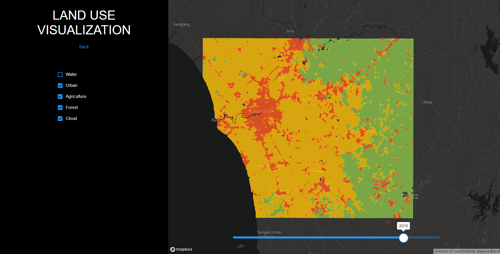
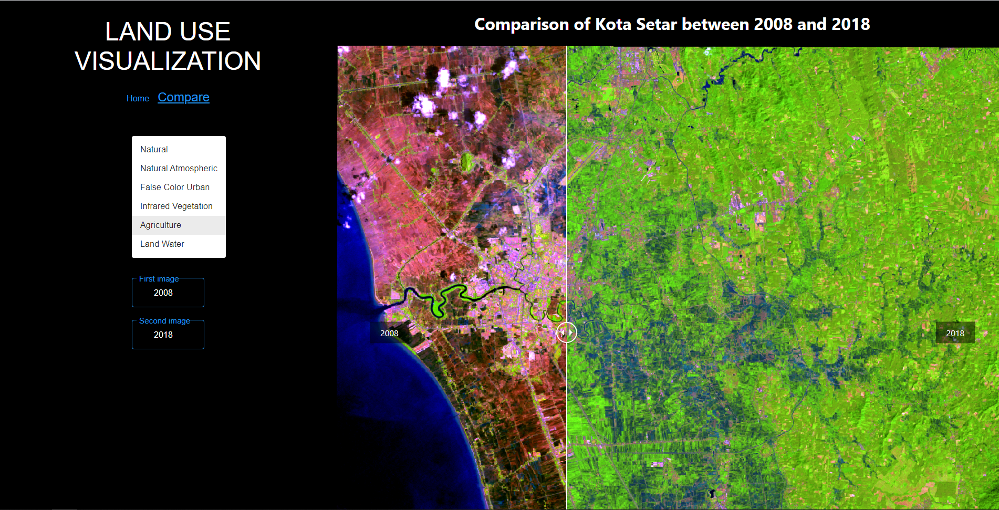

# Landcover Analytics
Created for Bachelor's Thesis. 
Allows user to control time slider, toggle layers of land cover and year and compare images side by side
Architecture:
- MongoDB Database
- ExpressJS and NodeJS Backend
- MapBox GL
- ReactJS Frontend

Classification process can be seen on https://github.com/jasonwvh/landcover-classification

## Explore

## Compare

Live: https://valulc.herokuapp.com/
